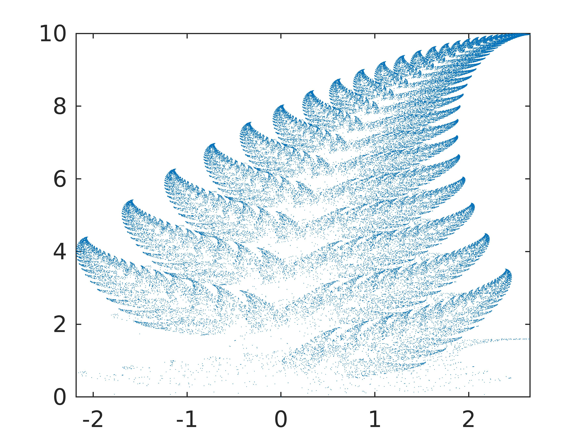

# BarnsleyLeafFractal

The fractal is generated from a set of iterated function system of equations in 2D -  
x(n+1) = a x(n) + b y(n) + e  
y(n+1) = c x(n) + d y(n) + f  
where the position of points at (n)th state determines the (n+1)th state of position.  
These set of equations are linear affine transforms and map one region of space into another, such that after each area mapped by the points keeps shrinking.

This set of transforms can be extended to from linear -> N multi-linear transforms such that there is a  
probability- p\_i associated to each transform,   
p\_1 + p\_2 + p\_3 + p\_4 ... + p\_N = 1  
and every iteration chooses one of the multi-linear transform with its associates probability p\_i. 

The multi-linear transforms are determined by a careful set of coefficients - a,b,c,d,e and f that play a huge role in the spectacular end result formed.

Barnsley leaf is generated by 4 sets of transforms given by - 

**Function 1** - probability = 0.01  
x(n+1) = 0 x(n) + 0 y(n) + 0  
y(n+1) = 0 x(n) + 0.16 y(n) + 0  

**Function 2** probability = 0.85  
x(n+1) = 0.85 x(n) + 0.04 y(n) + 0  
y(n+1) = -0.04 x(n) + 0.85 y(n) + 1.6  

**Function 3** probability = 0.07  
x(n+1) = 0.2 x(n) - 0.26  y(n) + 0  
y(n+1) = 0.23 x(n) + 0.22 y(n) + 1.6  

**Function 4** probability = 0.07  
x(n+1) = -0.15 x(n) + 0.28 y(n) + 0  
y(n+1) = 0.26 x(n) + 0.24 y(n) + 0.44  

[Matlab code](./fern.m)
